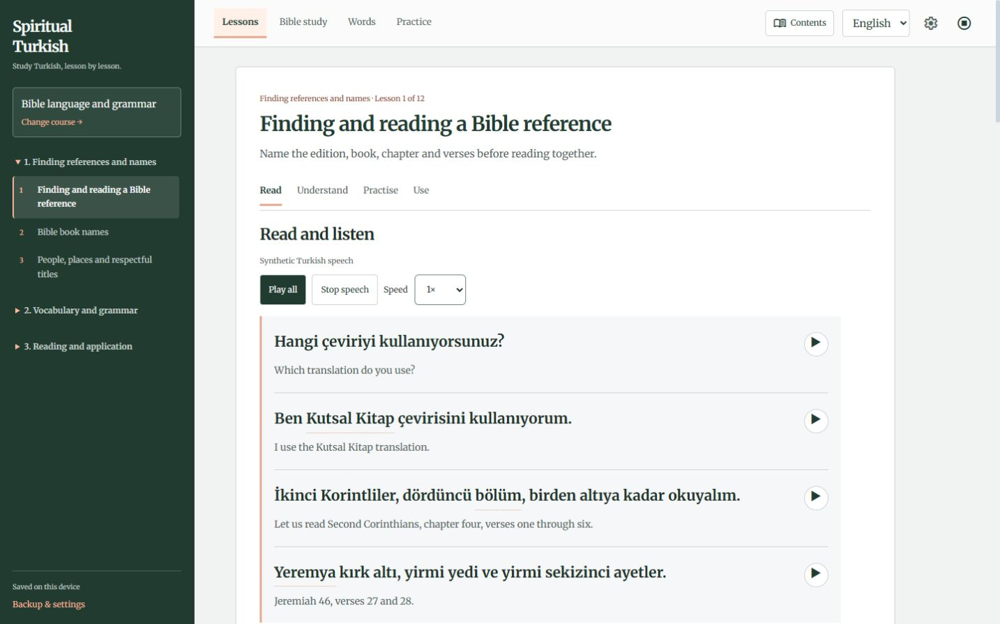
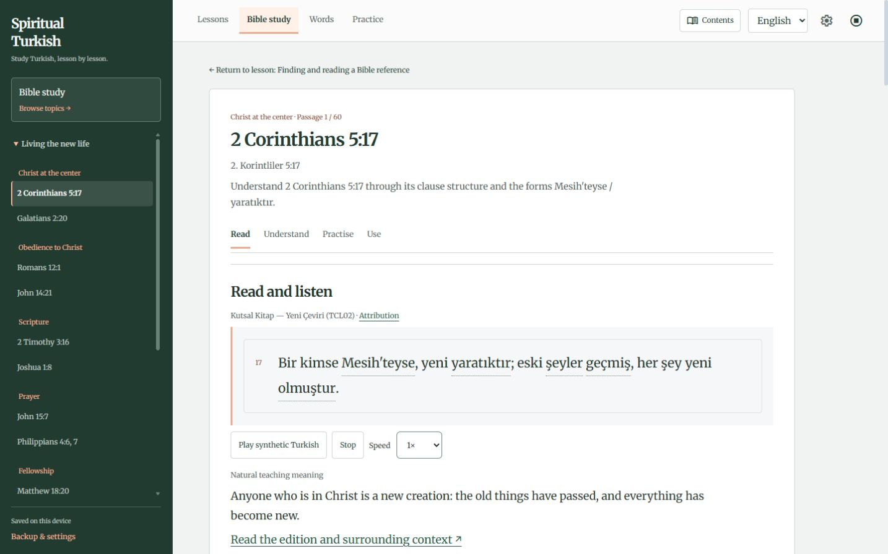
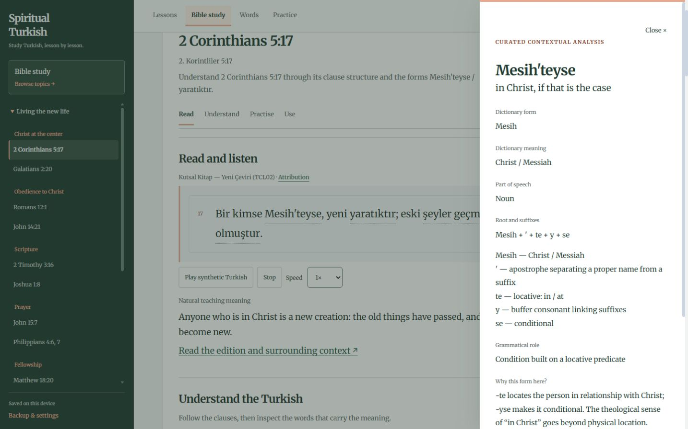
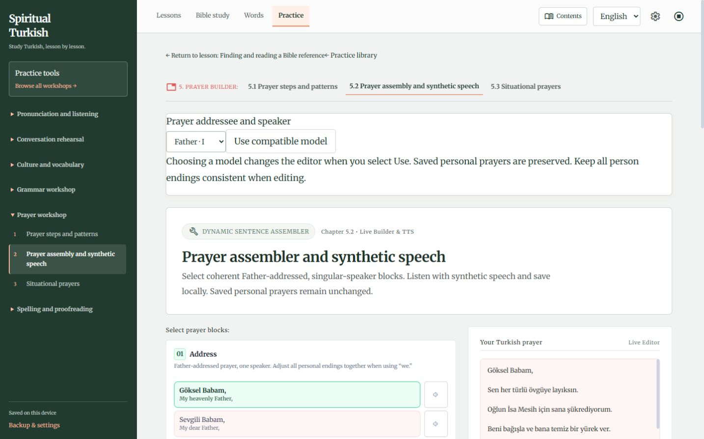
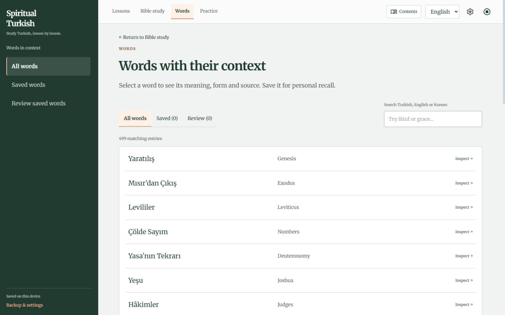
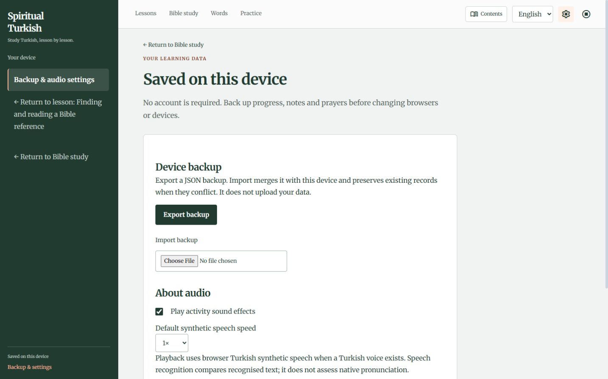
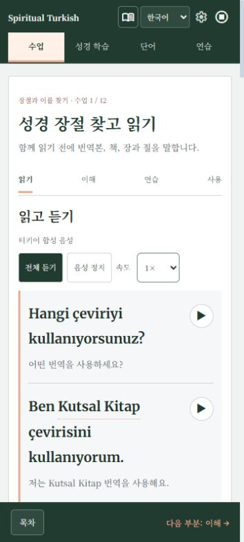
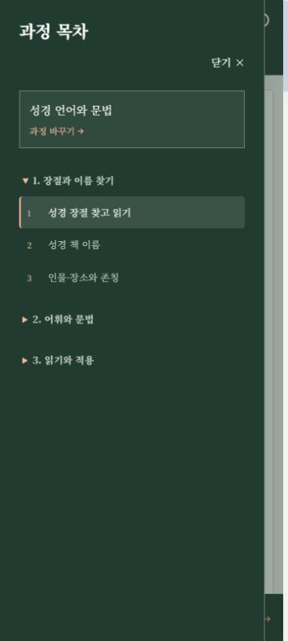
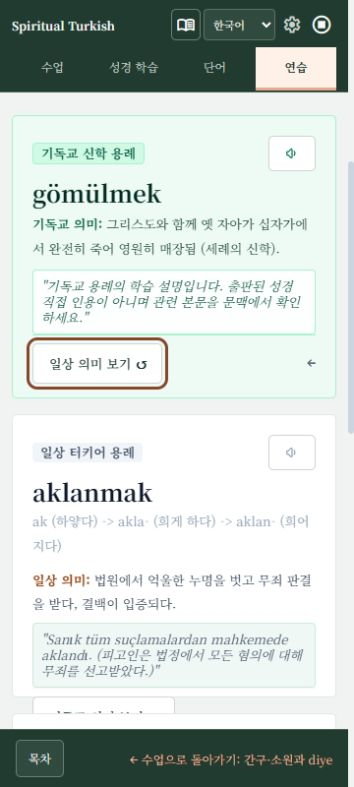
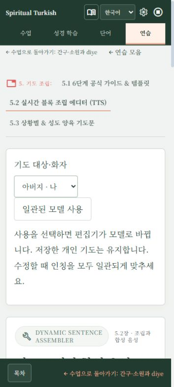

# Final website audit — 2 October 2026

The lesson-first application works across the full collection. The previous passing suites missed answer-editing, recovery, unsafe HTML and workshop interaction failures. The verified findings below are fixed on **codex/final-site-audit**. This is evidence of the tested behavior, not a guarantee that every possible defect has been eliminated.

Production inspected: https://greeksage.github.io/SpiritualTurkish/. Starting main: 40e4a31e556b4accbc813b5175dfc7ea3240b51f. Production was not changed by this audit.

## Scope and evidence

Reviewed the shared shell/routing, classroom/exercise renderer, Bible loader and inspector, storage/import/export/migration, retained pronunciation/dialogue/prayer/spelling tools, speech engine, language adapter, CSS, preview server, fixtures and CI. Before editing, all 20 original unit checks and original browser suites passed. New failures were reproduced with disposable isolated profiles, inert test strings and mocked APIs. Real learner storage was not cleared/imported and no real microphone permission or recording was used.

Screenshots 01–08 show the deployed application. Screenshots 09–10 show verified local fixes. Every saved image was inspected from disk. Source text, references, IDs, course order, prayers/notes, architecture, fonts and palette were preserved.

## Findings and fixes

| Verified issue | Fix and evidence |
| --- | --- |
| Prayer IDs inside inline JavaScript/HTML, titles in toast HTML, raw syllable/quiz input in markup | Escape learner strings and bind IDs through data attributes/listeners. Injection tests verify no inserted elements and preserve prayer content. Crafted imported/input strings could previously alter the page or execute script; no remote automatic exploit is claimed. |
| Changing a checked choice left success feedback and a successful saved answer | Clear feedback/completion, store the new unchecked choice, and check actual valid answers for completion. |
| Editing an open response or independent task left stale review/completion information | Invalidate the model review and displayed completion evidence on edits. |
| Retry rebuilt unrelated forms and lost unsubmitted selections | Reset only the requested exercise and restore input focus. |
| Optional Bible answer containers were accepted by import but crashed rendering | Default optional fields without dropping notes or activity state. |
| One malformed Bible record discarded other passages' notes | Recover records independently; backup validation remains strict and atomic. |
| Damaged saved-word/lesson containers crashed review or exercise handling | Recover usable records/defaults without discarding unrelated valid personal text. |
| FAITH returned zero results while faith returned five | Search with both Turkish and general Unicode case folding. |
| Valid Turkish uppercase quiz answers were rejected; edited answers retained old feedback | Use Turkish casing and clear feedback while retaining the draft. |
| Dynamic workshop/syllable speech buttons were skipped inside the new shell | Delegate retained workshop playback explicitly, exactly once. |
| Pending/active microphone sessions continued after navigation or target change | Abort on navigation, word change and global stop; ignore cancelled results and reset controls. Tested with a pending-start stub. |
| Exceptional voice lookup/synthesis/cancellation/recognition APIs broke playback or initialization | Catch failures and retain readable fallback and navigation. |
| Missing/denied clipboard APIs errored; library copy called a non-global toast | Shared awaited copy handling, safe data binding and manual-copy feedback. |
| Save reported durable success when storage failed; playback announced playing without a voice | Report session-only storage and retain exportable prayers; actual speech status controls availability feedback. |
| Meaning cards were mouse-only and inactive controls remained focusable | Native flip buttons, restored focus, inert/hidden inactive faces. Add bilingual labels to prayer, syllable and vowel-loss inputs. |
| Invalid Bible links looked like connection failures or empty topics | Translated not-found view with recovery; real fetch failures retain Retry. |
| Workshop return links visually ran together; prayer controls touched panel borders | Spaced wrapping return links and padded controls, tested in both languages at four widths. |
| Preview listened on all interfaces and accepted traversal/private paths; malformed requests were unsafe | Loopback binding, path/encoding/null-byte rejection and correct font MIME. Actual HTTP unit checks verify this. This concerns local preview, not GitHub Pages. |
| Korean README described old navigation and only the old quotation library | Document current four activities, 60 Bible lessons and retained source readings. |

## Journey walkthrough

### 1. Open a lesson — healthy

Chapter, position, objective, Turkish and playback are visible immediately. No dashboard gate. Classroom tests verify navigation/completion separately.

### 2. Read Bible study — healthy after recovery fixes

Selected topic, prominent Scripture and edition attribution are clear. Partial-state and invalid-link defects were reproduced through isolated tests rather than inferred from a screenshot.

### 3. Inspect morphology — healthy

Lemma, contextual meaning, suffixes and grammatical role remain distinct. Focus and speech fallback are tested; this image does not establish screen-reader behavior or linguistic correctness.

### 4. Use prayer tools — corrected

Production shows joined return links and unpadded mode controls. The six stages remain intact. Safety, labels, copy, speech and storage were tested separately.

### 5. Search words — corrected

Search, contextual inspection, saved words and pagination remain available. The casing failure requires the faith/FAITH regression test; a static screenshot cannot reveal it.

### 6. Open backup/settings — healthy after feedback fixes

Device storage is explained without a fictional account. Atomic imports, old backups, collisions, export and unavailable storage pass; real learner data was not destructively tested.

### 7. Study in Korean at 360px — healthy

Turkish appears in the initial viewport and Korean explanations/controls remain readable. Four-width and zoom checks supplement this image; physical-device chrome is unverified.

### 8. Open phone contents — healthy

Current chapter is expanded and lesson highlighted. Escape, focus return and lesson selection pass keyboard tests.

### 9. Switch meaning using the keyboard — corrected locally

Enter switches meaning and focus follows the visible return control; Space switches back. The inactive face is inert/hidden. These are teaching examples, not published Bible quotations.

### 10. Use workshop returns — corrected locally

The two returns now have a gap and can wrap; prayer controls have padding. The final screenshot was reloaded and checked against computed flex layout/16px padding. No personal prayer text is shown.

## Final checks

- **npm test: 21 passing unit/data/HTTP checks.**
- **npm run test:browser: all five suites passed**, including **21 targeted audit scenarios**. Existing 77 lessons/four sections, 82 reading routes, 24 workshops, 60 Bible passages and all 240 explained Bible answers remain functional. Bible teaching/answers render in both languages.
- English/Korean at **360/390/768/1440px**, navigation at 1024px and zoom. No unexpected document overflow, missing local assets or unexpected console/page errors in the suites.
- Back/reload, anchors, independent resumes, inspection/review, completion, drafts, backups/migration, missing storage/speech/voices, failed fetch retry and stale requests pass.
- CSS build passed; the existing Browserslist database-age notice remains a development warning. Coverage remains 77 lessons, 499 words, 82 source readings and 148 source pages. Diff check passes.
- Scripture fixtures remain unchanged: 60 selections, 74 selected numbered verses, 77 actually quoted verses. This audit made no Scripture edits.
- Manual production/local in-app-browser flows showed no unexpected console warnings/errors.

## Limits and release

Chromium/in-app browser was available. Safari, Firefox, real phones, screen-reader users, real recognition accuracy and installed voice quality remain unverified. Recognition stubs do not assess pronunciation. Independent Turkish/Korean specialist review is still pending; fingerprints and reconstructable suffix strings cannot prove contextual grammatical correctness.

Existing edition attribution, quotation ledger and rights/editorial limitations remain in BIBLE-STUDY-SOURCES.md and EDITORIAL.md. This audit did not establish a new publisher policy or expanded permission or certify legal compliance. Third-party destinations are outside the application's availability guarantee.

The fixes are for PR review. **No merge or deployment was performed.** Restart the local preview after updating server.js to receive its loopback/path protections.
